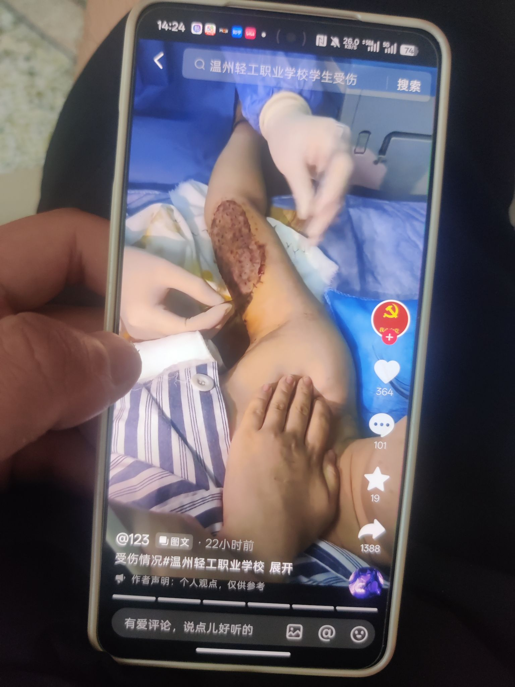
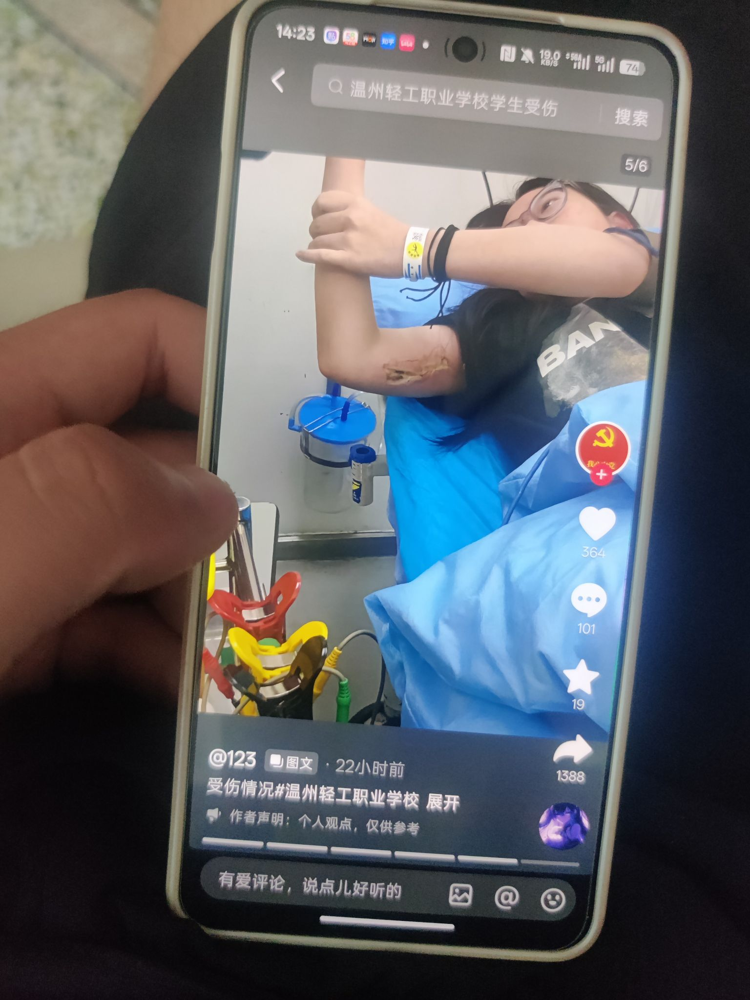
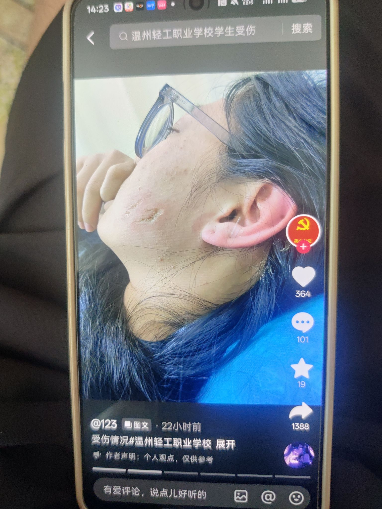
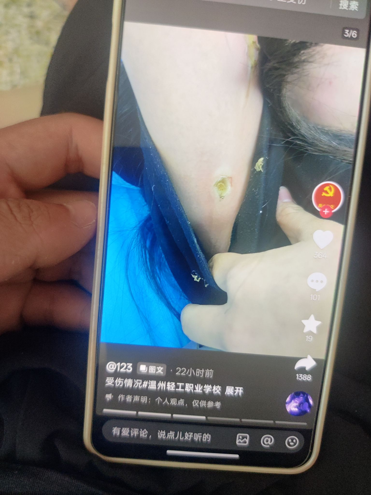
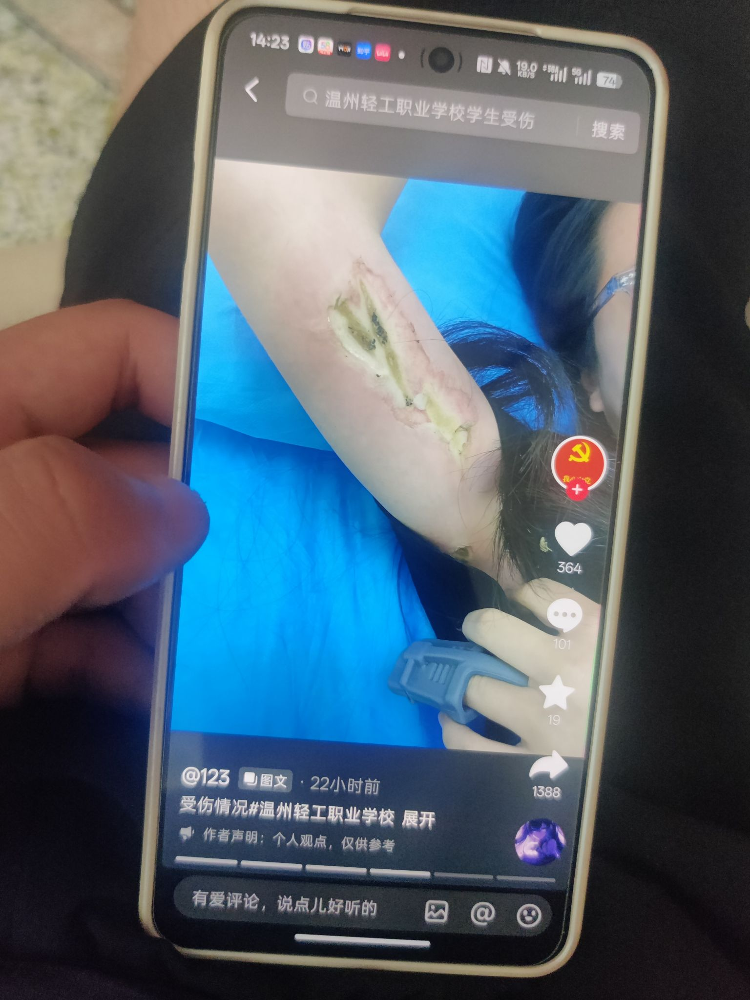

# 烫伤学生求助无门，轻工职校避责始末

> 内容编写人：Omia Sun（25电商3+2(1)班）

> 图片供给人：zhupizhen2-max（25无人机3+2(2)班）

---

事件经由学生潘芳瑜（化名：潘同学）为温州市轻工职业技术学校的学生,于2024年1月22日凌晨在寝室受收到电击伤。
潘同学在宿舍内拿着金属杆子(杆子为开学统一购买的蚊帐杆子,期末最后一天已拆开)
将手伸向窗外的空调外机上勾雪(空调外机平时有晒鞋子正常使用),窗外的高压电线橡胶圈老化脱皮,导致漏电致伤,
潘同学当场晕倒同寝室学生报告宿管要拨打120,同寝室友已经拨号出去,被宿管制止并表示坚决不打,
等到晚上值夜班的老师过来让同寝学生将潘的衣服穿好自己开车去医院。潘同学先被送达市中心医院急救中心后通知家长到医院,
进行简单处理转院至118医院烧伤科治疗。进行植皮手术后住院至2月5日出院。
医生开具医疗证明烧伤面积为3%。寒假过完校方主动提起休学申请,休学期间学生方多次提起对学生后期治疗费用及赔偿问题,
校方屡次回避并且让学生方去保险公司报理赔和做医疗鉴定。到2025年12月8日学校方给出结论只能赔付3万医疗费(不同意未执行)对于后期术后疤痕修复的费用拒不赔付
本人说说均是事实,对于第一次发出的信息进行更正。

学校的安全隐患导致我受到到伤害是事实
也希望网友理性看待,了解全貌发声不要再评论区
乱带节奏。

目前和学校联系中警方也已经介入

所有内容和图片类以抖音用户123（乃温州市轻工职业技术学校学生）发布为主，已同意授权发布，内容有些许变动，望请周知。

---

## 伤情照片

